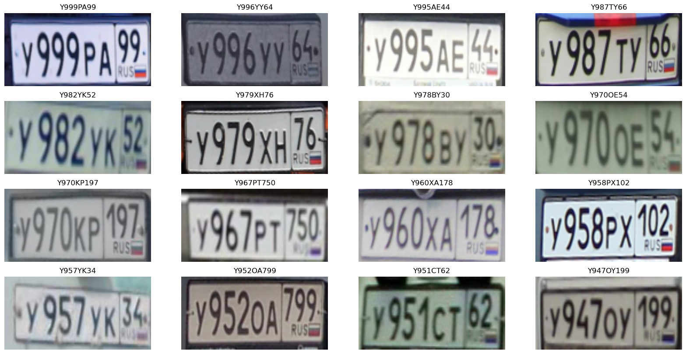

# VehicleNumberRecognizer
## Задача - разработка OCR нейросети для распознования Российских автомобильных номеров
### Архитектура - CRNN состоящая из STN, Resnet34 и BiLSTM слоёв
### Точность на тестовом датасете - 99.24%
### Ссылка на датасет - https://www.kaggle.com/datasets/evgrafovmaxim/nomeroff-russian-license-plates
## Пример работы:

